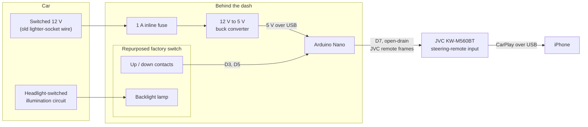

# JVC CarPlay Remote: Gesture controls for a repurposed factory switch in my 2003 Acura RSX

A DIY Arduino project that adds volume, track skip, mute and voice assistant
controls to a JVC KW-M560BT head unit, using a junkyard-sourced original RSX sunroof switch so that it looks factory.

