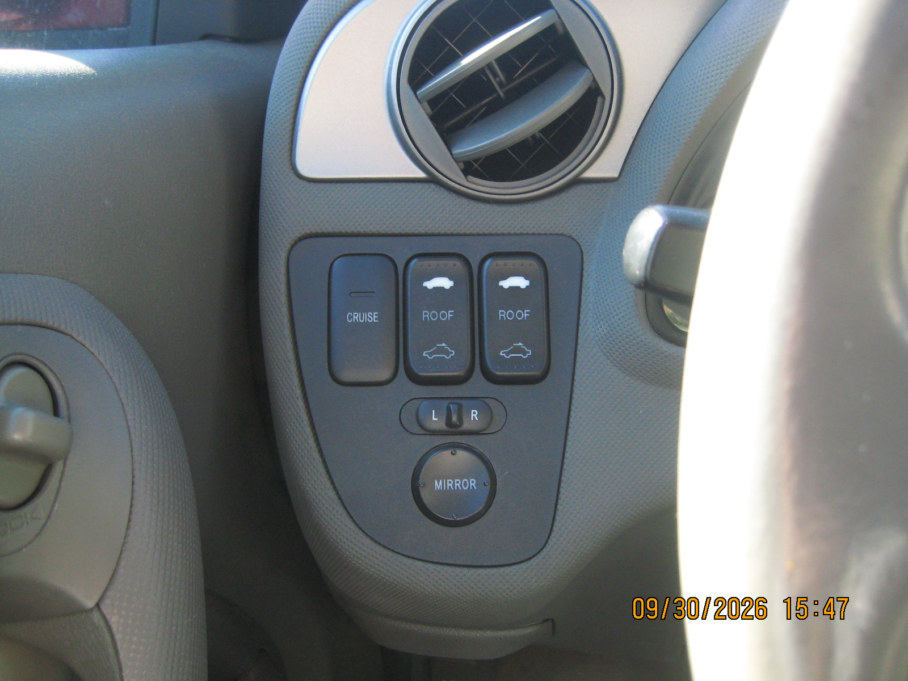
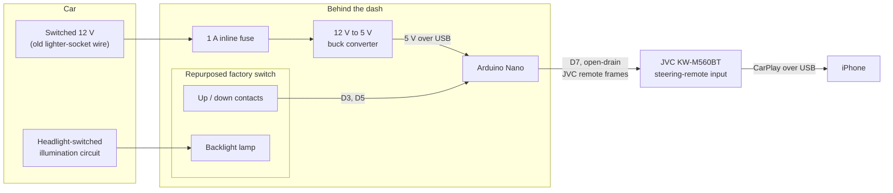
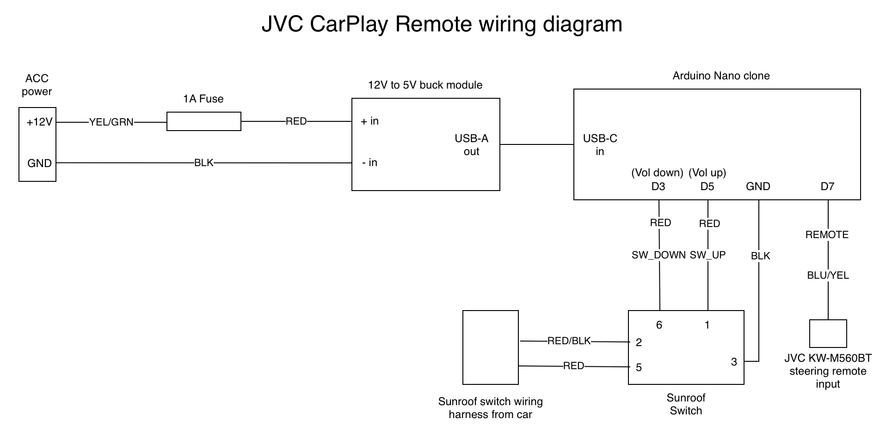

# JVC CarPlay Remote: Gesture controls for a repurposed factory switch in my 2003 Acura RSX

A DIY Arduino project that adds volume, track skip, mute and voice assistant controls to a JVC KW-M560BT head unit. It uses a junkyard-sourced original RSX sunroof switch in the unused fog light cutout, so it looks factory.

## What it does

Each direction of the rocker switch supports four gestures:

| Gesture | Switch down | Switch up |
|---|---|---|
| Tap | Volume down | Volume up |
| Double tap | Mute | Voice assistant (Siri) |
| Short hold, then release | Previous track | Next track |
| Long hold | Repeating volume down | Repeating volume up |

A tap is released in under 250 ms, a short hold is released between 250 and 500 ms, and anything held longer than 500 ms repeats. A double tap needs a second press within 150 ms of the first release.

## Overview

## Wiring

- **Switch:** common to GND, down to D3, up to D5. Both inputs use the Nano's internal pull-ups.
- **Head unit:** D7 to the JVC steering-remote wire (light blue/yellow), with a shared ground.
- **Power:** switched 12 V from the old cigarette lighter wire, through a 1 A fuse and a 12 V to 5 V buck converter, into the Nano's USB port.
- **Lamp:** the switch backlight is fed from the car's headlight-switched illumination wires.

Wire colors and terminal numbers come from the RSX service manual.

## How it works

JVC head units accept a "steering remote" signal on a single wire. The signal uses JVC's infrared remote format: a header, then a repeated frame containing a 7-bit address (0x47) and a 7-bit command. The pulse width is 527 µs.

- **Open-drain output.** D7 is only ever pulled low or released, never driven high. The head unit's own pull-up (about 3.2 V idle, measured) sets the idle level, so the Nano can't push voltage into the line.
- **Gesture detection.** The sketch debounces both contacts, then decides between a tap, a double tap, a short hold and a long hold from how long the switch stays pressed.
- **Frame repeats.** Most commands are sent three times per press, as in the original protocol. Mute is sent once, because it toggles.

| Command | Code |
|---|---|
| Volume up | 0x04 |
| Volume down | 0x05 |
| Mute | 0x0E |
| Next track / seek up | 0x12 |
| Previous track / seek down | 0x13 |
| Voice assistant | 0x1A |

### How I found the codes

The timing and the basic volume codes come from the AVForums thread below. The rest I found by scanning all 128 codes (0x00 to 0x7F) on the actual head unit with `tools/jvc_code_scanner`, sending one code at a time and watching the screen. That scan found mute, voice assistant and CarPlay track skip, which the thread didn't cover for this model.

## Limitations

- Tested only on a KW-M560BT with wired CarPlay. Other JVC units may use different codes.
- The head unit steps volume above about 15 even from its own buttons, so a held volume-up press needs a slower repeat (125 ms) to keep climbing.
- No scanned code pauses playback, so mute is the closest option.

## Parts

- Arduino Nano clone (ATmega328P)
- 12 V to 5 V buck converter with USB output
- Inline fuse holder and a 1 A fuse
- Original RSX sunroof switch
- USB cable, wire and connectors

## Repository layout

- `jvc_carplay_remote/`: the main sketch
- `tools/jvc_code_scanner/`: the code scanner used to find the commands
- `hardware/`: editable wiring diagram
- `docs/images/`: photos and exported diagrams

## Credits

Protocol timing and the base command set come from the ["JVC stalk adapter - DIY?" thread on AVForums](https://www.avforums.com/threads/jvc-stalk-adapter-diy.248455/).

## Safety

This modifies a car's wiring. Disconnect the battery before working on it, fuse any power tap, and use it at your own risk.

## License

MIT. See [LICENSE](LICENSE).
